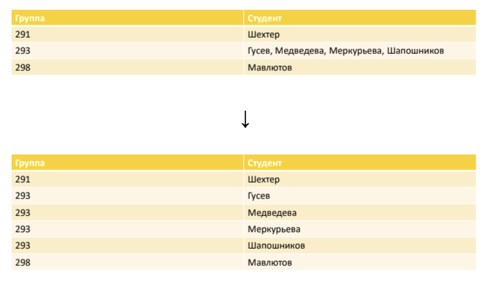
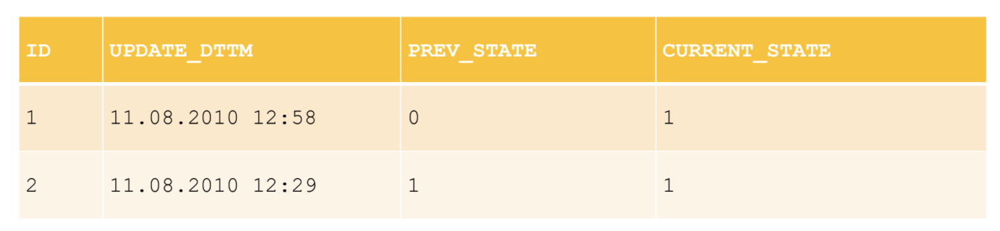
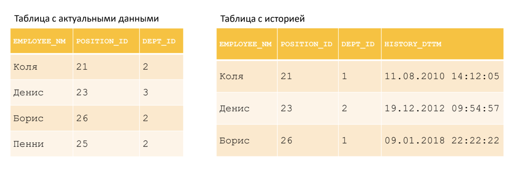

## Семинар 3. Проектирование, нормальные формы, версионирование

### 1. Проектирование

#### 1.1. Основные этапы проектирования

##### 1.1.1. Концептуальное проектирование

1. Определяем предметную область, с которой будем работать.

**Примеры:**
* Киносервис
* Ритейл
* Отельное агентство
* Образовательная платформа
* Персонал фирмы
        

2. Разбиваем на недетализированные сущности.

Например, для киносервиса можно выделить:
* Пользователи
* Сессии на платформе
* Фильмы
* Авторы
        

3. Определяем, как сущности будут друг с другом связаны.

Они могут иметь отношение "один к одному", "один ко многим" и другие - детальнее будет рассмотрено далее.

**Примеры:**
* Сущности отельного агентства "Отель" и "Фотографии отеля" имеют отношение *"один ко многим"*
* Сущности ритейла "Поставщик" и "Склад" имеют отношение *"один к одному"*
* Сущности образовательной платформы "Учебный курс" и "Покупатель" имеют отношение *"многие ко многим"*
    

4. Строим визуальную картину в ER-нотации (Entity-Relationship notation) "Воронья лапка" (Crow's Foot) без явных атрибутов. На этом этапе нам нужно выделить сущности в виде блоков и связать их между собой.

**Нотация "Воронья лапка"**

* Сущность изображается в виде прямоугольника, содержащего ее имя.
* Атрибуты сущности записываются внутри прямоугольника, изображающего сущность.
* Связь изображается линией, которая соединяет две сущности, участвующие в отношении.
* Множественность связи изображается в виде вилки.


Выше показана связь сущностей Artist и Song: песня (Song) имеет «одного и только одного» исполнителя (Artist); исполнитель связан с «нулем, одной или несколькими» песнями.

##### 1.1.2. Логическое проектирование

1. Разбиваем недетализированные сущности на детализированные согласно выбранной модели данных и нормализации.

Например, в области "Персонал фирмы" в сущности "Сотрудник" нет необходимости хранить вместе его зарплату, должность, персональные данные целиком одним блоком. Для этого можно разбить сущность на более мелкие.

Мотивация такого подхода - устранение избыточности данных (разбиение на логические части), безопасность доступа (можно разрешить пользователю СУБД иметь доступ только к некоторым таблицам, и таким образом ограничить его доступ к зарплате или персональным данным) и более простая поддержка в случае изменений данных (например, в сущности "Производитель" достаточно хранить только его *"Город"*, без *"Страны"*, т.к. у города случайно может поменяться страна, и в случае изменений придется пересчитывать таблицу полностью)

2. Определяем атрибуты.

Для каждой детализированной сущности определяем, что мы собираемся хранить.

3. Определяем связи между сущностями по атрибутам.

После того, как определили атрибуты для каждой сущности, нужно явно указать, по каким полям происходит связь. Это в частности позволит определить вторичные ключи, чтобы их указать при создании таблиц.

4. Строим визуальную картину в ER-нотации с явными атрибутами.

Переносим все детализированные изменения на визуальную картину.

##### 1.1.3. Физическое проектирование

Физическое проектирование — создание схемы базы данных внутри конкретной СУБД. 
Специфика СУБД может включать в себя ограничения на именование объектов базы данных, 
ограничения на поддерживаемые типы данных и тому подобное. Кроме того, специфика конкретной СУБД при физическом проектировании включает выбор решений, связанных с физической средой хранения данных (выбор методов управления дисковой памятью, 
разделение БД по файлам и устройствам, методов доступа к данным), создание индексов и так далее.

*Результатом* физического проектирования логической схемы может быть SQL-скрипт инициализации таблицы и/или готовая таблица с описанием каждой сущности. 

**Пример**:   
SQL скрипт:
```sql
CREATE TABLE IF NOT EXISTS STUDENT (
    STUDENT_ID   INTEGER      PRIMARY KEY,
    STUDENT_NAME VARCHAR(128) NOT NULL,
    ... 
);
...
```
И табличка с описанием:  

**STUDENT**

| Название       | Описание      | Тип данных     | Ограничение   |
|----------------| ------------- | -------------- | --------------|
| `STUDENT_ID`   | Идентификатор | `INTEGER`      | `PRIMARY KEY` |
| `STUDENT_NAME` | Имя студента  | `VARCHAR(128)` | `NOT NULL`    |
| ...            | ...           | ...            | ...           |


#### 1.2. ER-диаграммы

Модель «сущность-связь» (Entity-Relationship Model, ER-model) – одна из наиболее известных и получивших широкое распространение моделей семантического моделирования – разработана П. Ченом в 1976 году.

Основные элементы ER-модели:
* Сущность (entity) – это предмет, который может быть идентифицирован некоторым способом, отличающим его от других предметов.
* Атрибут – свойство сущности (как, правило, атомарное).
* Ключевый атрибут – уникальный атрибут, однозначно идентифицирующий экземпляр сущности.
* Связь (relationship) – это ассоциация, устанавливаемая между сущностями. Степень связи – количество связанных сущностей.

Выделяют следующие нотации ER-диаграмм:
* классическая нотация П. Чена;
* нотация IDEFIX (Integration Definition for Information Modeling);
* нотация Ч. Бахмана;
* нотация Дж. Мартина («вороньи лапки»);
* нотация Ж.-Р. Абриаля (минмакс);
* диаграммы классов UML.

При построении ER-модели важно различать типы бинарных связей, выделяют 4 типа:
* "**Ноль или более**";
* "**Один или более**";
* "**Только один**";
* "**Ноль или один**".


Каждая из них показывает, сколько значений из первой таблицы может находиться во второй таблице (это может быть непонятно при первом прочитывании; стоит вернуться после примера, рассмотренного далее). Тип связи определяется для обоих концов, то есть существует $\frac{4 \cdot 3}{2} + 4 = 10$ возможных связей ($\frac{4 \cdot 3}{2}$ связей с разными концами и 4 связи с одинаковыми концами).

На практике чаще всего реализуют следующие 3:

* "**Один-к-одному**" (One-to-One) - Каждая запись в первой таблице соответствует одной и только одной записи во второй таблице и наоборот.

* "**Один-ко-многим**" (One-to-Many) - Каждая запись в первой таблице соответствует одной или более записям во второй таблице, но каждая запись во второй таблице связана только с одной записью из первой таблицы.

* "**Много-ко-многим**" (Many-to-Many) - Записи в первой таблице могут быть связаны с многими записями во второй таблице и наоборот. Реализуется с помощью промежуточной таблицы (также известной как таблица связей или ассоциативная таблица).

Разберемся на **примере** отельного агентства. Рассмотрим сущности:

* Отель
* Отельная сеть (Azimut Hotels, Cosmos Hotel Group, ...)

1. Связь "*Отель*" - "*Отельная сеть*"

У фиксированного отеля может быть 0 или 1 отельная сеть, которой он принадлежит и под маркой которой он продается. При этом если мы рассмотрим какую-нибудь отельную сеть, то ей может принадлежать несколько отелей (причем если их 0, то можно как хранить эту сеть в таблице, так и не хранить - в зависимости от целей и наших желаний). Это значит, что "*Отель*" реализуется в "*Отельная сеть*" как "**Ноль или один**", а "*Отельная сеть*" реализуется в "*Отель*" как "**Ноль (Один) или более**".

Визуально эта связь реализуется так:


**Важно понимать**, что в *PostgreSQL*, как и в некоторых других СУБД, реализовать связь много-ко-многим напрямую невозможно (или по крайней мере проблематично).

Для этого рассмотрим **демонстративный пример**:

Есть 2 сущности:
1. *Студент*
2. *Учебный курс*


Каждая из них реализована в виде одной таблицы, пусть studentId и courseId - соответственно первичные ключи в этих таблицах. В таблице "*Студент*", чтобы не нарушать структуру и форму первичного ключа, список курсов нужно хранить в виде списка. В таком случае не ясно, есть ли здесь вторичный ключ, и как джойнить эти таблицы.

Для понятного указания СУБД, что есть первичный и вторичный ключ, courseId_list и studentId_list разворачивают в строки и помещают в отдельную, третью таблицу:


Таким образом, все проблемы в реализации и неоднозначности решаются.


**Пример ER-диаграммы для логической модели**:


ER-диаграммы можно рисовать в [gliffy](https://www.gliffy.com/) или [draw.io](https://app.diagrams.net/). Нужно создать новый документ и выбрать нужный тип диаграммы.

#### 1.3. Вопросы для закрепления материала

1. **Кейс:**  
   Компания занимается продажей товаров через интернет-магазин. В системе должны храниться следующие данные:  
   - информация о клиентах (имя, email, адрес),  
   - список товаров (название, описание, цена),  
   - список заказов (какой клиент заказал какие товары).  

   Каждый заказ может включать несколько товаров, и клиенты могут делать множество заказов.

   **Вопрос:**  
   Какую связь следует установить между сущностями "Клиент" и "Заказ"?  
   - a) Один-к-одному  
   - b) Многие-ко-многим  
   - c) Один-ко-многим  
   - d) Ноль или один-к-многим  

   <details>
   <summary>Правильный ответ:</summary>
   <p>c)</p>
   <p><strong>Объяснение:</strong> Один клиент может сделать много заказов, но каждый заказ принадлежит только одному клиенту.</p>
   </details>

2. **Кейс:**  
   В университете преподаватели проводят занятия в аудиториях. Необходимо хранить данные о:  
   - преподавателях (имя, ученая степень, кафедра),  
   - аудиториях (номер, вместимость),  
   - занятиях (дата, время, аудитория, преподаватель).  

   Один преподаватель может проводить занятия в разных аудиториях.

   **Вопрос:**  
   Какую связь необходимо установить между сущностями "Преподаватель" и "Занятие"?  
   - a) Многие-ко-многим  
   - b) Один-ко-многим  
   - c) Ноль или один-к-многим  
   - d) Один-к-одному  

   <details>
   <summary>Правильный ответ:</summary>
   <p>b)</p>
   <p><strong>Объяснение:</strong> Один преподаватель может проводить несколько занятий, но каждое занятие связано только с одним преподавателем.</p>
   </details>

---

3. **Кейс:**  
   В компании "Агентство недвижимости" необходимо хранить данные об:  
   - объектах недвижимости (адрес, тип — дом, квартира, офис),  
   - клиентах (имя, контакты),  
   - покупках (какой клиент купил какой объект недвижимости и дату покупки).  

   **Вопрос:**  
   Какая связь должна быть установлена между сущностями "Клиент" и "Объект недвижимости"?  
   - a) Один-к-одному  
   - b) Многие-ко-многим  
   - c) Один-ко-многим  
   - d) Ноль-к-одному  

   <details>
   <summary>Правильный ответ:</summary>
   <p>b)</p>
   <p><strong>Объяснение:</strong> Один клиент может купить несколько объектов, как и один объект может принадлежать разными клиентами. Поэтому связь "многие-ко-многим" нужно реализовать через промежуточную сущность, например, "Владение недвижимостью". Сущность "Покупка" в данном случае ничего не дает, хотя в простых вариантах можно сделать связь и через неё.</p>
   </details>
---

### 2. Нормальные формы

#### 2.1. Теоретическая справка

**Нормальная форма:**

На этапе создания базы данных мы определяем список требований к отношению и таблицам. Список этих требований задается *Нормальной формой* (НФ).


Нормальная форма — это свойство отношения в реляционной модели данных, которое помогает определить уровень избыточности данных и которое направлено на устранение функциональной зависимости, улучшение логической структуры данных и повышение целостности данных. Существует несколько *Нормальных форм*. Отсутствие нормализации может привести к аномалиям при вставке, обновлении и удалении данных, что потенциально приводит к логически ошибочным результатам выборки или изменения данных.


**Нормализация БД** — приведение БД к нормальной форме;
* Предназначена для:
    * Минимизации логической избыточности;
    * Уменьшения потенциальной противоречивости → устранение некоторых _аномалий_ обновления;
    * Разработки проекта БД, который является:
        * качественным представлением реального мира;
        * интуитивно понятным;
        * легко расширяемым в дальнейшем.
    * Упрощения процедуры применения необходимых ограничений целостности.
* Не предназначена для:
    * Изменения производительности БД;
    * Изменения физического объема БД.
* Производится за счет декомпозиции (разложения исходной переменной отношения на несколько эквивалентных) отношения:
    * декомпозиция без потерь (правильная) — обратимая декомпозиция.
* Польза:
    * Позволяет проектировать неплохие БД на первых порах.
    * Помогает избегать типичных ошибок при проектировании БД людям без опыта.
    * Формирует привычку делать нормально сразу, не оставляя на потом.
    * Постепенно вырабатывает навык проектирования, без прочной завязки на нормальных формах.

**Аномалия** — ситуация в таблице БД, возникшая из-за излишнего дублирования в таблице, такая, что:
* Существенно осложнена работа с БД;
* В БД присутствуют противоречия.

**Нормальные формы:**
1. *Первая нормальная форма (1NF, 1 НФ)*:
    * Значения всех атрибутов отношения атомарны (все атрибуты простые, содержат только скалярные значения):



2. *Вторая нормальная форма (2NF, 2 НФ)*:
    * 1NF (атомарность атрибутов) + каждый неключевой атрибут функционально полностью зависит от потенциального ключа (1NF всегда можно привести к 2NF, и этот процесс обратим):

Здесь автор слов и композитор зависят только от полей “Название группы” и “Название песни”, то есть от подмножества PK (от того, что песня включена в другой CD-диск, автор слов и композитор не изменятся)


3. *Третья нормальная форма (3NF, 3 НФ)*:
    * 2NF (атомарность атрибутов, минимальная функциональная зависимость от PK) + каждый неключевой атрибут нетранзитивно функционально зависит от первичного ключа (то есть каждое неключевое поле полностью и единственный образом определяется ключом, полным ключом и ни от чего более не зависит)

Здесь присутствуют функциональные зависимости:
* Сотрудник → Отдел
* Отдел → Телефон
* Сотрудник →Телефон


Разбиваем таблицу так, чтобы избавиться от транзитивности: разносим атрибуты "Сотрудник" и "Телефон" по разным отношениям.

4. *Нормальная форма Бойса-Кодда (BCNF)*
5. *Четвертая нормальная форма (4NF)*
6. *Пятая нормальная форма / Нормальная форма проекции-соединения (5NF / PJNF)*
7. *Доменно-ключевая нормальная форма (DKNF)*
8. *Шестая нормальная форма (6NF)*

**Функциональная зависимость** между множествами атрибутов X и Y означает,  что для любого допустимого набора кортежей в данном отношении верно следующее: если два кортежа совпадают по значению X, то они совпадают по значению Y.

**Минимальная функциональная зависимость** — ни для одного из атрибутов мы не можем выделить подмножество в потенциальном ключе, такое, чтобы атрибут от него функционально зависел.

#### 2.2. Вопросы для закрепления материала


1. **Кейс:**  

Рассмотрим таблицу, где IT-компания хранит отчеты о затратах на выполнение различных проектов:

   | ProjectID | TeamMembers                 | Expenses                     | Deadline       |
   |-----------|-----------------------------|------------------------------|----------------|
   | 101       | Иван Иванов, Анна Смирнова | Закупка оборудования: 50000, Регистрация ПО: 15000 | 2023-12-31    |
   | 102       | Петр Петров                | Закупка оборудования: 30000                   | 2023-11-15    |
   | 103       | Иван Иванов, Петр Петров   | Аналитика данных: 20000, Закупка сервиса: 10000 | 2023-12-01    |

   **Проблема:**
   - Значения в колонке `TeamMembers` содержат **списки участников**.
   - Значения в колонке `Expenses` содержат **сложные структуры (имя транзакции + сумма)**.
   - Таблица не имеет явного ключа.

   **Вопрос:**  
   В какой нормальной форме находится эта таблица?  
   - a) Первая нормальная форма (1NF)  
   - b) Вторая нормальная форма (2NF)  
   - c) Третья нормальная форма (3NF)  
   - d) Ненормализованная форма (0 НФ)

   <details>
   <summary>Правильный ответ:</summary>
   <p>d)</p>
   <p><strong>Объяснение:</strong> Таблица находится в 0 НФ, так как:</p>
   - Колонка `TeamMembers` нарушает атомарность (список участников).  
   - Колонка `Expenses` содержит вложенные структуры (транзакции с суммами).  
   - Нет выраженного первичного ключа, уникально идентифицирующего строки.  

   **Для приведения в нормализованную форму (1NF):**
   1. Разделить `TeamMembers` на отдельные строки: один член команды = одна строка для проекта.
   2. Разделить `Expenses` на отдельную таблицу: каждая транзакция = одна строка. 

   **Решение — нормализованные таблицы:**

   **Таблица Projects:**  
   | ProjectID | Deadline       |
   |-----------|----------------|
   | 101       | 2023-12-31    |
   | 102       | 2023-11-15    |
   | 103       | 2023-12-01    |

   **Таблица TeamMembers:**  
   | ProjectID | TeamMember       |
   |-----------|------------------|
   | 101       | Иван Иванов      |
   | 101       | Анна Смирнова    |
   | 102       | Петр Петров      |
   | 103       | Иван Иванов      |
   | 103       | Петр Петров      |

   **Таблица Expenses:**  
   | ProjectID | ExpenseType          | ExpenseAmount |
   |-----------|----------------------|---------------|
   | 101       | Закупка оборудования | 50000         |
   | 101       | Регистрация ПО       | 15000         |
   | 102       | Закупка оборудования | 30000         |
   | 103       | Аналитика данных     | 20000         |
   | 103       | Закупка сервиса      | 10000         |

 </p>
   </details>

2. **Кейс:**  
   Рассмотрим таблицу, где хранятся следующие данные о сотрудниках компании:  

   | Сотрудник  | Должность   | Отдел       | Руководитель отдела   |
   |------------|-------------|-------------|------------------------|
   | Иванов И.  | Программист | IT          | Сидоров С.            |
   | Петров П.  | Аналитик    | IT          | Сидоров С.            |
   | Сидоров С. | Директор    | Руководство | Иванов А.             |

   Первичный ключ: "Сотрудник"

   В этой таблице наблюдается **транзитивная зависимость**:  
   - Поле "Отдел" напрямую зависит от поля "Должность".  
   - Поле "Руководитель отдела" зависит от "Отдела".  

   **Вопрос:**  
   Какую нормальную форму необходимо применить, чтобы устранить транзитивные зависимости и минимизировать избыточность данных?  
   - a) Первая нормальная форма (1 НФ)  
   - b) Вторая нормальная форма (2 НФ)  
   - c) Третья нормальная форма (3 НФ) 
   - d) Ненормализованная форма (0 НФ)

   <details>
   <summary>Правильный ответ:</summary>
   <p>c)</p>
   <p><strong>Объяснение:</strong> Таблицу необходимо привести к третьей нормальной форме (3NF), устранив транзитивные зависимости. Для этого нужно выделить следующие таблицы:</p>

   **Решение:**  
   1. Создаем отдельную таблицу для хранения данных о должностях и их отделах:  
      | Должность   | Отдел       |
      |-------------|-------------|
      | Программист | IT          |
      | Аналитик    | IT          |
      | Директор    | Руководство |

   2. Создаем таблицу для отделов и их руководителей:  
      | Отдел       | Руководитель отдела   |
      |-------------|------------------------|
      | IT          | Сидоров С.            |
      | Руководство | Иванов А.             |

   3. Основная таблица "Сотрудники" теперь будет ссылаться только на должность:  
      | Сотрудник  | Должность   |
      |------------|-------------|
      | Иванов И.  | Программист |
      | Петров П.  | Аналитик    |
      | Сидоров С. | Директор    |

---

3. **Кейс:**  
   Рассмотрим таблицу, где хранятся данные о продажах в интернет-магазине:

   | Заказ ID | Товар               | Категория          | Покупатель       | Дата рождения   |
   |----------|---------------------|--------------------|------------------|-----------------|
   | 1        | Телевизор           | Техника            | Иванов И.И.      | 2003-01-01      |
   | 2        | Стиральная машина   | Техника            | Сидоров П.П.     | 2005-06-01      |
   | 2        | Телевизор           | Техника            | Сидоров П.П.     | 2005-06-01      |

   **Составной первичный ключ:** ("Заказ ID", "Товар")

   Хотим исправить следующие проблемы:  
   1. **Дублирование данных:** `Категория` (например, "Техника") повторяется для каждого товара в каждом заказе. Однако категория зависит только от самого товара, а не от сочетания "Заказ ID" и "Товар".  
   2. **Частичная зависимость:** Поля `Покупатель` и `Дата рождения` зависят только от `Заказ ID`, но не зависят от всего составного ключа ("Заказ ID", "Товар").

   **Вопрос:**  
   Какую нормальную форму необходимо применить, чтобы устранить эти проблемы?  
   - a) Первая нормальная форма (1 НФ)  
   - b) Вторая нормальная форма (2 НФ)  
   - c) Третья нормальная форма (3 НФ)

   <details>
   <summary>Правильный ответ:</summary>
   <p>b)</p>
   <p><strong>Объяснение:</strong> Необходимо привести таблицу к 2 НФ. Это включает устранение частичных зависимостей, т.е. выделение информации о покупателях и товарах в отдельные таблицы, чтобы исключить дублирование.</p>

   **Решение:**  

   1. **Избавляемся от дублирования товаров и категорий.**
      Создаем отдельную таблицу для товаров и их категорий:  
      | Товар               | Категория          |
      |---------------------|--------------------|
      | Телевизор           | Техника           |
      | Стиральная машина   | Техника           |

   2. **Выделяем данные о покупке в отдельную таблицу.**
      Убираем частичную зависимость `Покупатель` и `Дата рождения` от "Заказ ID" и выделяем информацию о заказе в отдельную таблицу:  

      **Таблица "Заказы" (обратить внимание, что эта таблица находится в 2 НФ, однако её можно перевести в 3 НФ, однако в проблемах кейса это не подсвечено):**  
      | Заказ ID | Покупатель       | Дата рождения   |
      |----------|------------------|-----------------|
      | 1        | Иванов И.И.      | 2003-01-01      |
      | 2        | Сидоров П.П.     | 2005-06-01      |

      **Таблица "Детали заказа" (заказанные товары):**  
      | Заказ ID | Товар               |
      |----------|---------------------|
      | 1        | Телевизор           |
      | 2        | Стиральная машина   |
      | 2        | Телевизор           |

   </details>

---

### 3. Версионирование

#### 3.1. SCD. Типы SCD

**SCD (Slowly Changing Dimension)** —  редко изменяющиеся измерения, то есть измерения, не ключевые атрибуты которых имеют тенденцию со временем изменяться.

Выделяют пять основных типов:

* **SCD 0**: после попадания в таблицу данные никогда  не изменяются — не поддерживает версионность. Практически никогда не используется.
* **SCD 1**: данные перезаписываются (всегда актуальные) — используется, если история не нужна.

    * _Достоинства:_
        * Не добавляет избыточность
        * Очень простая структура

    * _Недостатки:_
        * Не хранит историю

* **SCD 2**: храним историю с помощью двух полей (дата начала действия, дата окончания действия: `valid_from`, `valid_to`) — _используется наиболее часто_.

    * _Достоинства:_
        * Хранит полную и неограниченную историю версий
        * Удобный и простой доступ к данным необходимого периода

    * _Недостатки:_
        * Провоцирует на избыточность или заведение доп. таблиц для хранения изменяемых атрибутов
        * Требует добавление техничеких полей, что немного захламляет общую таблицу
        * В случае обращения только к актуальным данным придется фильтровать таблицу, что может быть очень долгим процессом


Вместо `NULL` часто используется некоторая константа (для `valid_to — '9999-12-31'`), что позволяет писать простое условие:
```sql
WHERE day_dt BETWEEN valid_from_dttm AND valid_to_dttm
```
вместо
```sql
WHERE day_dt >= valid_from_dttm
    AND (day_dt <= valid_to_dttm
        OR valid_to_dttm IS NULL)
```
или
```sql
WHERE day_dt BETWEEN valid_from_dttm AND coalesce(
    valid_to_dttm, TO_TIMESTAMP('01-01-5999 00:00:00', 'DD-MM-YYYY HH24:MI:SS')
)
```

* **SCD 3**: храним старое значение для выделенных атрибутов в отдельных полях. При получении новых данных старые данные перезаписываются текущими значениями.
    * _Достоинства:_
        * Небольшой объем данных
        * Простой и быстрый доступ к истории
    * _Недостатки:_
        * Ограниченная история
        * Требует добавления технического поля в общую таблицу



* **SCD 4**: храним в основной таблице только актуальные данные и историю изменений в отдельной таблице. Основная таблица всегда перезаписывается текущими данными с перенесением старых данных в другую таблицу. Обычно этот тип используют для аудита изменений или создания архивных таблиц.
    * _Достоинства:_
        * Быстрая работа с текущими версиями
        * Сохраняет PK и структуры таблицы в актуальном, легко интерпретируемом виде без лишней информации, что позволяет удобно на нее ссылаться
        * Удобное хранение истории в одном месте в удобном виде
    * _Недостатки:_
        * Разделение единой сущности на разные таблицы
        * Хранение часто меняющихся данных требует большой объем памяти



**Важно понимать, что версионирование, как и нормальная форма, внутри базы данных может отличаться для разных таблиц. Выбирать их нужно исходя из нужд, доступных ресурсов и особенности хранимых данных.**

#### 3.2. Вопросы для закрепления материала

1. **Таблица:**  
   | ProductID | ProductName  | Price | Category     |
   |-----------|--------------|-------|--------------|
   | 1         | Телевизор    | 600   | Техника      |
   | 2         | Чайник       | 60    | Техника      |

   Цена на товары обновляется при необходимости, но старая информация не хранится.

   **Вопрос:**  
   В какой SCD находится эта таблица?  
   - a) SCD 0  
   - b) SCD 1  
   - c) SCD 2  
   - d) SCD 3  
   - e) SCD 4 

   <details>
   <summary>Правильный ответ:</summary>
   <p>b)</p>
   </details>

---

2. **Таблица:**  
   | ProductID | ProductName  | Price | Category     |
   |-----------|--------------|-------|--------------|
   | 1         | Телевизор    | 500   | Техника      |
   | 2         | Чайник       | 50    | Техника      |

   Данные в таблице никогда не изменяются после их добавления.

   **Вопрос:**  
   В какой SCD находится эта таблица?  
   - a) SCD 0  
   - b) SCD 1  
   - c) SCD 2  
   - d) SCD 3  
   - e) SCD 4 

   <details>
   <summary>Правильный ответ:</summary>
   <p>a)</p>
   </details>

---

3. **Таблица 1 (Актуальные данные):**  
   | ProductID | ProductName  | Price |
   |-----------|--------------|-------|
   | 1         | Телевизор    | 600   |
   | 2         | Чайник       | 60    |

   **Таблица 2 (История данных):**  
   | ProductID | ProductName  | Price | ChangeDate  |
   |-----------|--------------|-------|-------------|
   | 1         | Телевизор    | 500   | 2023-06-01  |
   | 2         | Чайник       | 50    | 2023-06-01  |

   История изменений хранится в отдельной таблице.

   **Вопрос:**  
   В какой SCD находится эта структура данных?  
   - a) SCD 0  
   - b) SCD 1  
   - c) SCD 2  
   - d) SCD 3  
   - e) SCD 4  

   <details>
   <summary>Правильный ответ:</summary>
   <p>e)</p>
   </details>

---

4. **Таблица:**  
   | ProductID | ProductName  | Price | Category     | ValidFrom | ValidTo     |
   |-----------|--------------|-------|--------------|-----------|-------------|
   | 1         | Телевизор    | 500   | Техника      | 2023-01-01 | 2023-06-01  |
   | 1         | Телевизор    | 600   | Техника      | 2023-06-02 | 9999-12-31  |

   Таблица хранит данные о текущих и предыдущих значениях с указанием дат действия записей.

   **Вопрос:**  
   В какой SCD находится эта таблица?  
   - a) SCD 0  
   - b) SCD 1  
   - c) SCD 2  
   - d) SCD 3 
   - e) SCD 4  

   <details>
   <summary>Правильный ответ:</summary>
   <p>c)</p>
   </details>

---

### 4. Практическое задание

Для каждой из следующих предметных областей

* Физтех. Ключевые сущности: физтех-школа, кафедра, студент, преподаватель, аудитория, расписание занятий.
* Розничная сеть магазинов. Ключевые сущности: магазин, сотрудник, товар, чек, карта лояльности, кассовый аппарат.

требуется:

1. спроектировать концептуальные базы данных;

2. выбрать нормальную форму и версионность;

3. описать спроектированные модели с помощью языка запросов SQL;

4. придумать 3 осмысленных SQL-запроса с использованием JOIN и как минимум 1 запрос с обращением к историчным данным.


Предоставим **некоторые наброски решения** для предметной области "*Физтех*". На семинаре и в домашнем проекте требуется сделать более полную работу.

1. Концептуальная схема


2. Логическая схема


Здесь для employee применено версионирование SCD 4, для остального - SCD 1. По хорошему для других таблиц по возможности нужно сделать так же SCD 4 (например, для phsytech_school, student).

Везде применена 3 НФ.

3. Физическая схема

Создание и заполнение таблиц - в `ddl.sql`.

Написать самостоятельно следующие запросы:

1. Посчитать количество студентов, которые изучают курс "Базы данных"

2. Вывести старост групп, которые изучают хотя бы один курс, который ведет "Павлов Марат Маратович"

3. Вывести список аудиторий, в которых в понедельник проходит курс "Теория вероятности" (обратить внимание, что один курс может читаться разными кафедрами, поэтому *course_name* не может быть первичным ключом).

4. Вывести количество преподавателей, которые меняли свою кафедру.

Решения - в `dml.sql`.
